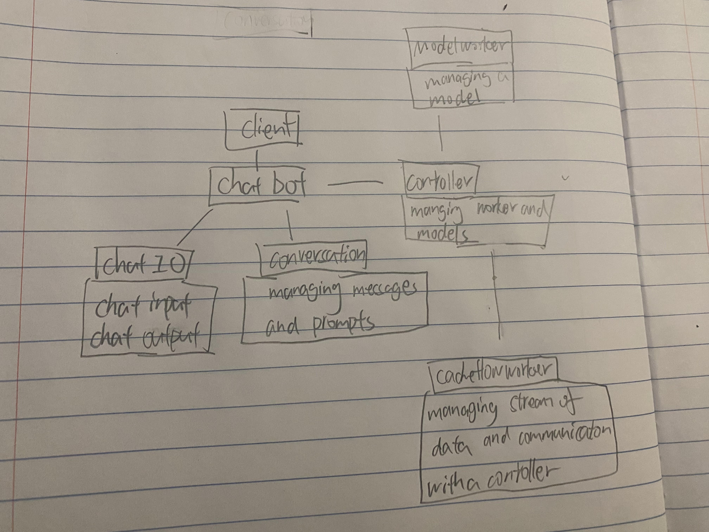

# INFO443_Project2
INFO443 Project 2

## Members:
 - Aaron Liu
 - Haochen Dong
 - Lucas Zhou
 - Osbert Lee

## Introduction to FastChat

### - What is FastChat?

FastChat is a open-source training, serving, and evaluating large language model based chatbots. As an open-source tool, it has released Vicuna, an open-source chatbot that has demonstrated the ability to rival GPT-4 in terms of quality, achieving a 90% ChatGPT rating. This platform offers users the capability to interact with FastChat in natural language and provides various interfaces such as CLI and WebGUI for ease of use. The ultimate aim of FastChat is to simplify the creation and deployment of chatbots, enabling businesses and organizations to enhance their customer interactions through natural language processing.

### - Who creates FastChat?

FastChat is a community-driven open-source project, which is not affiliated with any specific commercial entity. The development team behind FastChat is officially known as "Lmsys," and their website can be found at "https://lmsys.org/blog/". Based on our analysis of the GitHub repository, we have identified Ying Sheng, a Ph.D. student at Stanford University's Computer Science Department, as the primary maintainer of the platform. In addition, we have observed that over 16 different developers have contributed to the FastChat platform in the past month.

## Report Overview and Introduction

In this project, we will be working with FastChat: an open-source platform created to streamline the process of creating and deploying chatbots. This program covers every aspect of building a chatbot. This includes training, servering, and evaluating the chatbots based on large language models. One example of FastChat’s success is with Vicuna: an open-source chatbot that has proven its abilities to rival the quality of GPT-4. This achievement has an impressive 90% ChatGPT rating, thus highlighting the remarkable capabilities of FastChat.

One aspect of FastChat that makes it so great is how intuitive it is to use. FastChat allows users to seamlessly interact with the platform using everyday text messaging, making it accessible and intuitive. FastChat provides users with flexible options based on their preferences and requirements. This is due to the different interfaces FastChat provides, such as the Command Line Interface (CLI) and WebGUI.  By prioritizing user experience, FastChat empowers individuals and organizations to leverage the power of chatbots without unnecessary complexities or obstacles.

What makes FastChat a stronger competitor compared to other products in the field is because of the community-driven nature of this open-source project. The development team, known as "Lmsys," leads the initiative, and Ying Sheng, a Ph.D. student from Stanford University's Computer Science Department, serves as the primary maintainer of the platform. The active involvement of over 16 developers in the past month demonstrates the vibrant and inclusive community surrounding FastChat.

By focusing on simplicity and empowering users, FastChat simplifies the creation and deployment of chatbots. FastChat's commitment to open-source principles and its collaborative community ensure that it continues to evolve, improve, and adapt to emerging needs and technological advancements. With FastChat, businesses and organizations can deliver enhanced user experiences and foster meaningful connections.

## Development View

## Applied Perspective

FastChat, as an open-source platform for training, serving, and evaluating large language model-based chatbots, can be analyzed from various perspectives.  Form Scalability Perspective: Given the potentially high demand for language model-based chatbots, understanding how well FastChat can handle growth in terms of data, users, and/or requests is important.

## Identify Styles & Patterns Used

### Architectural Style:

#### Microservices

The FastChat code base implements a microservices architecture, which is a style of software architecture that structures an application as a collection of loosely coupled services. Each service is self-contained and can be developed, deployed, and scaled independently of the other services in the system. In the FastChat code base, the ChatService class is the main microservice that handles all communication between clients. The ChatService class is designed to be self-contained and can be deployed and scaled independently of other services in the system.

#### Event-Driven Architecture

The FastChat code base also implements an event-driven architecture, which is a style of software architecture that emphasizes the production, detection, consumption, and reaction to events. In the FastChat code base, the ChatService class produces events when a new message is received, and clients consume those events to update their UI. The Observer pattern is used to implement the event-driven architecture, with clients registering themselves as observers of the ChatService class to receive notifications when a new message is received.                                                                                                        

### Design Patterns:

#### Factory Method

- Context: The FastChat code base uses the Factory Method pattern to create instances of the ChatService class.
- Problem: The ChatService class has several subclasses that need to be created dynamically based on user input.
- Solution: The Factory Method pattern allows the ChatService class to delegate the creation of its subclasses to a separate factory class, which can create the appropriate subclass based on user input.

#### Singleton

- Context: The FastChat code base uses the Singleton pattern to ensure that only one instance of the ChatService class is created.
- Problem: The ChatService class should only have one instance to ensure that all clients are communicating with the same service.
- Solution: The Singleton pattern ensures that only one instance of the ChatService class is created and provides a global point of access to that instance.

#### Observer

- Context: The FastChat code base uses the Observer pattern to notify clients when a new message is received.
- Problem: Clients need to be notified when a new message is received so that they can update their UI.
- Solution: The Observer pattern allows clients to register themselves as observers of the ChatService class and receive notifications when a new message is received.

#### Decorator

- Context: The FastChat code base uses the Decorator pattern to add functionality to the ChatService class.
- Problem: The ChatService class needs to be able to handle different types of messages.
- Solution: The Decorator pattern allows the ChatService class to dynamically add functionality to handle different types of messages.

## Architectural Assessment

In the following segment, we will conduct an in-depth architectural assessment of FastChat, viewing it through the lens of design principles. FastChat has established itself as a potent tool in the current market, attributed to its intricate design and well-structured formatting. Our primary focus in this section will be the application of the SOLID principles in its architecture.The SOLID principles encompass the Single Responsibility Principle, the Open-Closed Principle, the Liskov Substitution Principle, the Interface Segregation Principle, and the Dependency Inversion Principle. A thorough examination of FastChat's server files, including data, API server, end-to-end evaluation pipelines, models, and training files, reveals that its entire backend system subscribes to these principles.However, notwithstanding its overall adherence to SOLID principles, there are certain nuances that seem to contravene these principles. Herein, we will present several instances identified in the system that showcase such contradictions.

- The Dependency Inversion Principle states that high-level modules should not depend on low-level modeyles, and both of them should depend on abstractions. Furthermore the abstractions should not depend upon details. And details should depend on abstractions. By checking the model system architecture, we found that the model’s architecture adheres to the DIP by separating the model of FastChat into each small components/classes in the model file. Moreover, in each model files, for example the model_adapter.py, it contains an base adapter class and its derived classes such as VicunaAdapter, T5Adapter, KoalaAdapter, etc. demonstrate the Dependency Inversion Principle. The high-level modules (functions using these adapters) do not depend on the low-level modules (the specific adapter classes) but both depend on abstractions (the BaseAdapter class). This is a good design because it decouples the high-level modules from the low-level modules, making the code more flexible and easier to modify or extend.

- In the same file, the model_adapter.py, it also follows the principle of Liskov Substution Principle. The Liskov Substitution Principle is that if a program is using a base class, it should be able to use any of its subclasses without the program knowing or behaving unexpectedly. And according to the LSP, we found that all the subclasses can be used interchangeably without causing any issues because they all follow the same interface as defined by the BaseAdapter class. This means that a derived class object can replace a base class object without affecting the correctness of the program, which is the core of LSP.

- We also found that in the base adapter class, it potentially violates the OCP form the SOILD principle. The OCP, Open-Closed Principle, states that software entities (classes, modules, functions, etc.) should be open for extension, but closed for modification. This means that we should be able to add new functionality or behavior to a class without altering its source code. However, the method load_model has explicit dependencies on device types such as "cpu", "cuda", and "mps". This violates the OCP because if a new device type is introduced (e.g., a new type of GPU or TPU), you would have to modify the load_model method to accommodate it. This shows the method isn't closed for modification. Besides, the handling of various configurations and settings is also hard-coded into the load_model method. If you need to change how configurations are handled or if there are new configurations to be added, you would have to modify this method. The potential solutions to these problems includes abstracting the notion of a "device" and allow the handling of device-specific operations to be extended without modifying existing code, or creating flexible configuration system that allows new settings to be added without modifying existing code.

## System Improvement
