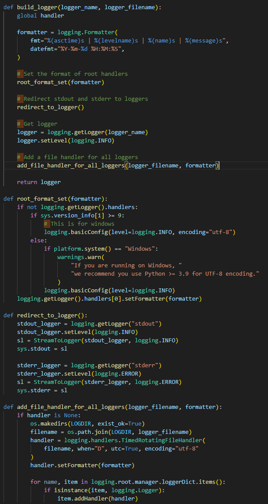

# INFO443_Project2
INFO443 Project 2

## Members:
 - Aaron Liu
 - Haochen Dong
 - Lucas Zhou
 - Osbert Lee

## Introduction to FastChat

### - What is FastChat?

FastChat is a open-source training, serving, and evaluating large language model based chatbots. As an open-source tool, it has released Vicuna, an open-source chatbot that has demonstrated the ability to rival GPT-4 in terms of quality, achieving a 90% ChatGPT rating. This platform offers users the capability to interact with FastChat in natural language and provides various interfaces such as CLI and WebGUI for ease of use. The ultimate aim of FastChat is to simplify the creation and deployment of chatbots, enabling businesses and organizations to enhance their customer interactions through natural language processing.

### - Who creates FastChat?

FastChat is a community-driven open-source project, which is not affiliated with any specific commercial entity. The development team behind FastChat is officially known as "Lmsys," and their website can be found at "https://lmsys.org/blog/". Based on our analysis of the GitHub repository, we have identified Ying Sheng, a Ph.D. student at Stanford University's Computer Science Department, as the primary maintainer of the platform. In addition, we have observed that over 16 different developers have contributed to the FastChat platform in the past month.

## Report Overview and Introduction

In this project, we will be working with FastChat: an open-source platform created to streamline the process of creating and deploying chatbots. This program covers every aspect of building a chatbot. This includes training, servering, and evaluating the chatbots based on large language models. One example of FastChat’s success is with Vicuna: an open-source chatbot that has proven its abilities to rival the quality of GPT-4. This achievement has an impressive 90% ChatGPT rating, thus highlighting the remarkable capabilities of FastChat.

One aspect of FastChat that makes it so great is how intuitive it is to use. FastChat allows users to seamlessly interact with the platform using everyday text messaging, making it accessible and intuitive. FastChat provides users with flexible options based on their preferences and requirements. This is due to the different interfaces FastChat provides, such as the Command Line Interface (CLI) and WebGUI.  By prioritizing user experience, FastChat empowers individuals and organizations to leverage the power of chatbots without unnecessary complexities or obstacles.

What makes FastChat a stronger competitor compared to other products in the field is because of the community-driven nature of this open-source project. The development team, known as "Lmsys," leads the initiative, and Ying Sheng, a Ph.D. student from Stanford University's Computer Science Department, serves as the primary maintainer of the platform. The active involvement of over 16 developers in the past month demonstrates the vibrant and inclusive community surrounding FastChat.

By focusing on simplicity and empowering users, FastChat simplifies the creation and deployment of chatbots. FastChat's commitment to open-source principles and its collaborative community ensure that it continues to evolve, improve, and adapt to emerging needs and technological advancements. With FastChat, businesses and organizations can deliver enhanced user experiences and foster meaningful connections.

## Development View

## Applied Perspective

The perspective I am considering in this report is scalability. Scalability refers to the ability of a system to handle the increased load by either increasing the capacity of the existing hardware or by adding additional resources. The desired qualities from this perspective include the ability to handle the increased load, maintain performance under increased load, and the ability to add resources to handle the increased load.

FastChat is an open platform for training, serving, and evaluating large language models. It includes state-of-the-art models, a distributed multi-model serving system, and OpenAI-compatible RESTful APIs. From a scalability perspective, the following concerns are relevant:

Load Handling: As an open platform, FastChat is likely to face varying loads. The ability to handle the increased load without degradation in performance is crucial.
Resource Management: FastChat includes a distributed multi-model serving system. Efficient management of resources in this distributed system is important for scalability
Performance: FastChat provides OpenAI-compatible RESTful APIs. Maintaining the performance of these APIs under increased load is important for user satisfaction and system usability.

To apply the scalability perspective, the following activities are performed:

Analyzing Load Handling: Analyzing how FastChat handles increased load involves understanding the architecture of the system, specifically how it distributes load across different components. This can be done by reviewing the system's design documents and conducting stress tests to see how the system performs under heavy load.

Assessing Resource Management: This involves understanding how FastChat manages resources in its distributed multi-model serving system. It includes understanding how resources are allocated and deallocated, how the system scales up and down based on load, and how efficiently it uses resources.

While applying the scalability perspective, it's important to watch out for the following potential problems and pitfalls:

Bottlenecks: These are parts of the system that can limit overall capacity. They can occur at any point in the system where the capacity is limited. Identifying and addressing bottlenecks is crucial for improving scalability.

Overprovisioning: While it's important to have enough resources to handle peak load, overprovisioning can lead to unnecessary costs. It's important to find a balance between having enough resources to handle peak load and not having so many that resources are wasted.

In conclusion, considering the scalability perspective is crucial for ensuring that FastChat can handle increased load and continue to provide a high level of performance. This involves careful analysis and planning, as well as ongoing monitoring and adjustment as the system's load changes.

## Identify Styles & Patterns Used

### Architectural Style:

#### Microservices

FastChat is structured using a microservices architecture, a software architectural style that organizes an application as a collection of loosely coupled, independently deployable services. In FastChat's context, each service, such as the ChatService class, encapsulates a specific functionality and can be developed, deployed, and scaled independently. This architecture was chosen due to its flexibility in allowing FastChat to expand or modify its functionalities independently, enhancing scalability and reliability. It empowers FastChat to rapidly adapt to changes and innovate, essential for any organization striving to provide an evolving and quality AI chat service.

#### Event-Driven Architecture

Additionally, FastChat leverages an event-driven architecture, a model that focuses on the production, detection, consumption, and reaction to events. In the FastChat environment, events such as receiving a new message, are produced by the ChatService class. Clients then consume these events to update their User Interface (UI). FastChat uses the Observer pattern to implement this architecture, with clients registering themselves as observers of the ChatService class to receive event notifications. This architecture style enhances responsiveness and scalability, as the system reacts in real-time to user interactions, a critical feature for a conversational AI platform like FastChat that must process and respond to user input promptly.                                                                                                       

### Design Patterns:

#### Factory Method

- Context: The Factory Method pattern is employed in FastChat to manage the creation of ChatService instances dynamically.
- Problem: The ChatService class necessitates several dynamically created subclasses based on user input.
- Solution: The Factory Method pattern delegates the creation of the ChatService subclasses to a separate factory class based on the user's input. This pattern contributes to code robustness and extensibility in the system, by abstracting the instantiation process, thus allowing for the dynamic addition of new subclasses in the future, which aligns with FastChat's goal of continuous improvement and adaptability.

#### Singleton

- Context: FastChat uses the Singleton pattern to manage access to the ChatService class.
- Problem: A unique instance of the ChatService class is needed to ensure that all clients are communicating via the same service.
- Solution: The Singleton pattern ensures that only one instance of the ChatService class exists, providing a global point of access to it. This pattern is vital to ensure consistent interactions between the chat service and all clients, promoting effective and synchronized communication.

#### Observer

- Context: FastChat employs the Observer pattern to manage notifications to clients upon receipt of a new message.
- Problem: Client UIs need to be promptly updated when a new message is received.
- Solution: The Observer pattern allows clients to register themselves as observers of the ChatService class, receiving notifications when a new message arrives. This design pattern is essential for ensuring real-time updates and responsiveness in the system, which is a key attribute for an efficient chatbot system.

#### Decorator

- Context: FastChat uses the Decorator pattern to extend the functionality of the ChatService class.
- Problem: The ChatService class needs to dynamically handle various types of messages.
- Solution: The Decorator pattern enables the ChatService class to dynamically add new functionalities to handle different message types. It allows the chat service to be flexible and adaptable, enhancing its ability to process various kinds of user input, a crucial feature for any versatile chatbot system.

## Architectural Assessment

In the following segment, we will conduct an in-depth architectural assessment of FastChat, viewing it through the lens of design principles. FastChat has established itself as a potent tool in the current market, attributed to its intricate design and well-structured formatting. Our primary focus in this section will be the application of the SOLID principles in its architecture.The SOLID principles encompass the Single Responsibility Principle, the Open-Closed Principle, the Liskov Substitution Principle, the Interface Segregation Principle, and the Dependency Inversion Principle. A thorough examination of FastChat's server files, including data, API server, end-to-end evaluation pipelines, models, and training files, reveals that its entire backend system subscribes to these principles.However, notwithstanding its overall adherence to SOLID principles, there are certain nuances that seem to contravene these principles. Herein, we will present several instances identified in the system that showcase such contradictions.

- The Dependency Inversion Principle states that high-level modules should not depend on low-level modeyles, and both of them should depend on abstractions. Furthermore the abstractions should not depend upon details. And details should depend on abstractions. By checking the model system architecture, we found that the model’s architecture adheres to the DIP by separating the model of FastChat into each small components/classes in the model file. Moreover, in each model files, for example the model_adapter.py, it contains an base adapter class and its derived classes such as VicunaAdapter, T5Adapter, KoalaAdapter, etc. demonstrate the Dependency Inversion Principle. The high-level modules (functions using these adapters) do not depend on the low-level modules (the specific adapter classes) but both depend on abstractions (the BaseAdapter class). This is a good design because it decouples the high-level modules from the low-level modules, making the code more flexible and easier to modify or extend.

- In the same file, the model_adapter.py, it also follows the principle of Liskov Substution Principle. The Liskov Substitution Principle is that if a program is using a base class, it should be able to use any of its subclasses without the program knowing or behaving unexpectedly. And according to the LSP, we found that all the subclasses can be used interchangeably without causing any issues because they all follow the same interface as defined by the BaseAdapter class. This means that a derived class object can replace a base class object without affecting the correctness of the program, which is the core of LSP.

- We also found that in the base adapter class, it potentially violates the OCP form the SOILD principle. The OCP, Open-Closed Principle, states that software entities (classes, modules, functions, etc.) should be open for extension, but closed for modification. This means that we should be able to add new functionality or behavior to a class without altering its source code. However, the method load_model has explicit dependencies on device types such as "cpu", "cuda", and "mps". This violates the OCP because if a new device type is introduced (e.g., a new type of GPU or TPU), you would have to modify the load_model method to accommodate it. This shows the method isn't closed for modification. Besides, the handling of various configurations and settings is also hard-coded into the load_model method. If you need to change how configurations are handled or if there are new configurations to be added, you would have to modify this method. The potential solutions to these problems includes abstracting the notion of a "device" and allow the handling of device-specific operations to be extended without modifying existing code, or creating flexible configuration system that allows new settings to be added without modifying existing code.

- In the serve folder, there is a file named 'model_worker.py'. The model_worker.py manage a pool of machine learning model where these models can be used for various tasks such as generating text, calculating embeddings, etc. In this file, the ModelWoker seems violating the Single Responsibility Principle. The Single Responsibility Principle states that a class should only have one responsibility. Furthermore, it should only have one reason to change. The ModelWorker class has multiple responsibilities. It's responsible for loading the model, generating responses, managing heartbeats, and managing communication with a controller. This violates the SRP because a class should have only one reason to change.One of the possible solution to the violation could be considering breaking down the ModelWorker class into smaller, more focused classes. For instance, you could create a separate class for handling the communication with the controller, another one for heartbeats management, and so on. This way, each class will only have one reason to change, thus adhering to the SRP.

- The train.py file in the train folder can be a good example of adherence of the Single Responsibility Principle. The SupervisedDataset and LazySupervisedDataset classes adhere to the Single Responsibility Principle. They have one main job: to manage and prepare the dataset for the training process. This includes loading the data, preprocessing it, and providing individual examples when indexed. This clear separation of responsibilities makes it easier to maintain and extend these classes.

- However, in the same file, we found out that the LazySupervisedDataset class could potentially violate the Liskov Substitution Principle (LSP). Here, LazySupervisedDataset extends SupervisedDataset, but changes the behavior of the __getitem__ method. In SupervisedDataset, data preprocessing is done upfront, and __getitem__ simply retrieves preprocessed data. However, in LazySupervisedDataset, __getitem__ also does preprocessing when an item is requested. This change in behavior could lead to issues if the code expecting a SupervisedDataset isn't aware of this. A way to resolve this is to create a separate preprocess_item method in both SupervisedDataset and LazySupervisedDataset. In SupervisedDataset, this method would just return the preprocessed data, while in LazySupervisedDataset, it would do the preprocessing. This makes it clear that this operation can have different behaviors depending on the class, which makes the code more understandable and less prone to bugs.

## System Improvement
Refactoring Steps:

1. In the file `fastchat/serve/model_worker.py`, the class ModelWorker is built. The class ModelWorker requires an Extract Function fix in the ` __init__ `. The fix is located at the end of the ` __init__ ` where there is a comment that says "generate stream" followed by a dozen lines of code. By following Martin's rules, we can extract these lines of code and create a separate function to do so.

1. In the file `fastchat/train/train_flant5.py`, the class SupervisedDataset is generated. The class SupervisedDataset requires multiple Extract Function fixes in the ` __init__ ` of this class. To fix this, I found comments that were describing different sections of code, and I took those lines of code and followed Martin's rule of extraction and named the new function based on the comment describing the section of code. In total, I did two code fixes here for `shuffle_data` and `remove_short_qa`

1. In the file `fastchat/utils.py` there are many Extract Function fixes that need to be made. In the `build_logger` function, there are three sections of code that are marked by comments. Each section does its own function, so let's move all of them into separate functions like so. Now there are three different functions with detailed names to describe what they are doing [instead of sectioning with comments].

Notable Bug Change + Feature Improvement + Tests

I found that user `davzucky` created issue 1538 [[https://github.com/lm-sys/FastChat/issues/1538](https://github.com/lm-sys/FastChat/issues/1538)] regarding the ValueError caused by when a user inputs an incomplete model\_name. To fix this bug, I created a list of all model names and when the function `get_gen_params` is called in the `openai_api_server.py` file, there is a checker to determine whether the inputted `model_name` is in the list of correct, full names. If not, an error will be caused with details on why this input is incorrect. Additionally, I added two test cases for this bug fix in the file `test_openai_api_server.py`. The two tests will test a working `model_name` and a faulty `model_name`.

For our feature improvement, we could not find an issue in the FastChat github that we could solve on our own, so we decided to create our own small feature improvement! We noticed in the issues that there were a handful of users that were updating the params generated by the function above `get_gen_params` very frequently. The users were doing this by calling the params' dictionary and updating it manually. We decided that this should be a standardized process, so we created a function to update the params called `update_params` located in the file `openai_api_server.py`. This new function will standardize the process of updating a params after it has already been generated. There is one test written for this function to test if the update has gone through. This test is located in the `test_openai_api_server.py`.
